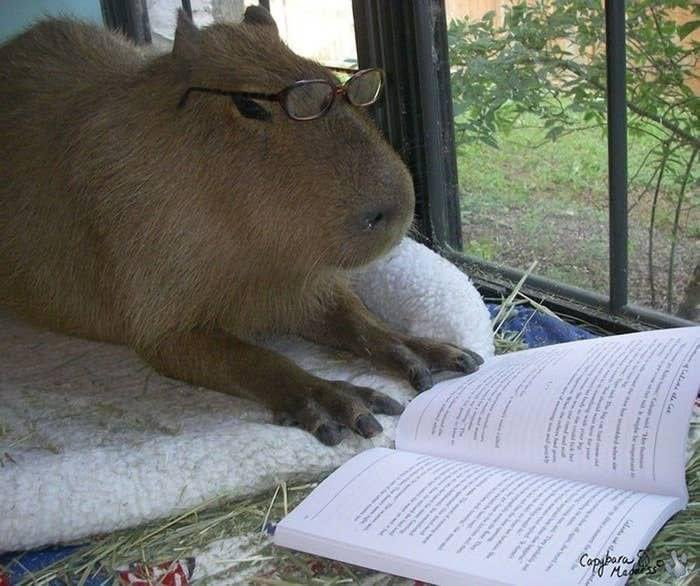

<h3>Olá, eu sou novo por aqui, estou estudando para ser um programador Full-Stack.</h3>

Ainda tenho muito o que estudar.

Para mais informações, meu portfólio está <a href="https://leomartinez013.github.io/Portfolio/" target="_blank">aqui</a>

 

    

   

  
          

